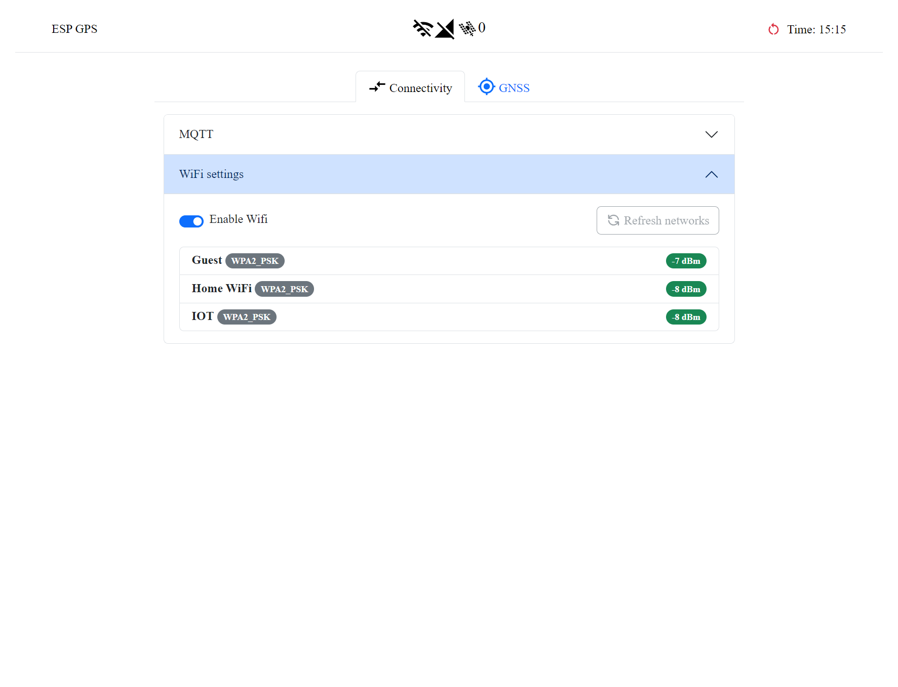
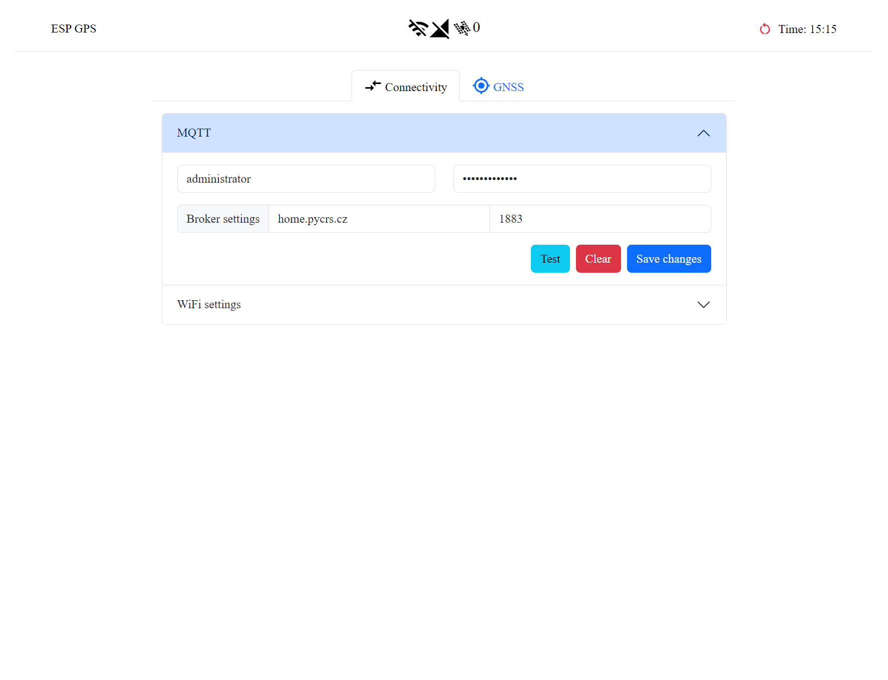
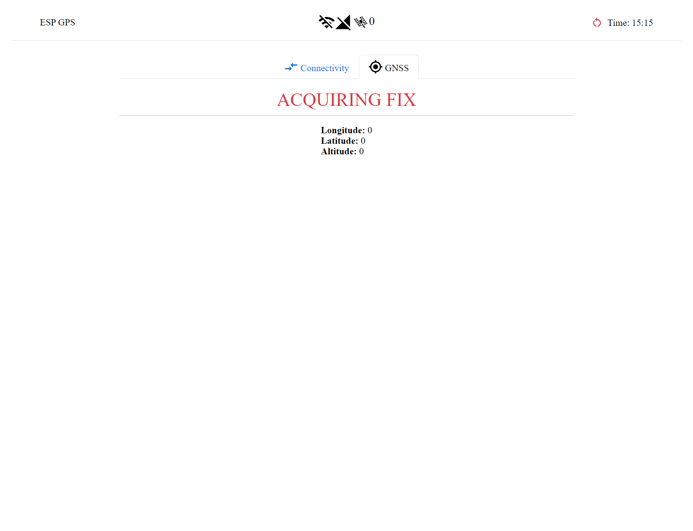

The ESP32 runs a web server that allows you to configure the device. To access the web server, you need to connect to its WiFi network and navigate to the web interface. The following steps will guide you through the process:

1. Power on the device by connecting it to a USB power source.
2. Wait for the device to boot up. Either wait till it connects to a WiFi network indicated by the integrated blue LED or wait for it to time out
3. Press the dedicated button on the device to enable the WiFi hotspot. The other blue LED will light up to indicate that the hotspot is active.
4. Connect to the WiFi network named `ESGPS-<MAC>` where `MAC` is the MAC address of the device's WiFi interface (e.g. `ESP-1A:2B:3C:4D:5E:6F`). There is no password required to connect to the network.
5. Open a web browser and navigate to `http://192.168.0.1` - the IP address of the "router".
6. You should see the configuration page. If you don't, try refreshing the page or power cycling the device.

## WiFi configuration

In the WiFi configuration section, you can configure the device to connect to your WiFi network. The device will automatically connect to the last connected network on boot. 

## MQTT configuration

In the MQTT configuration section, you can configure the device to connect to an MQTT broker. It is necessary to provide the credentials as well as the broker's IP address (or hostname). The port is optional and defaults to **1883**.

## GNSS debugging

An additional debugging feature is available to help you debug GNSS issues. This section is getting real-time GNSS data over WebSockets giving you the ability to see the raw data coming from the GNSS module.

