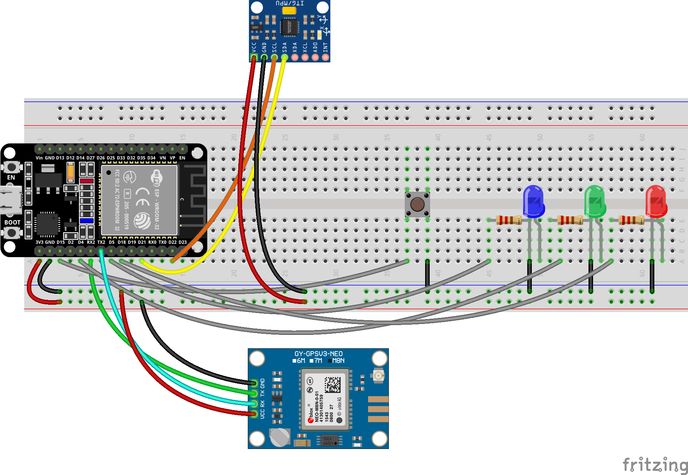
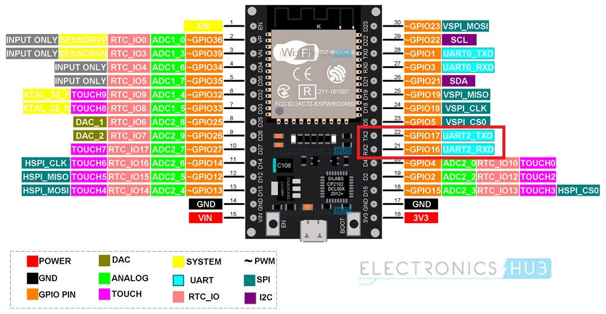
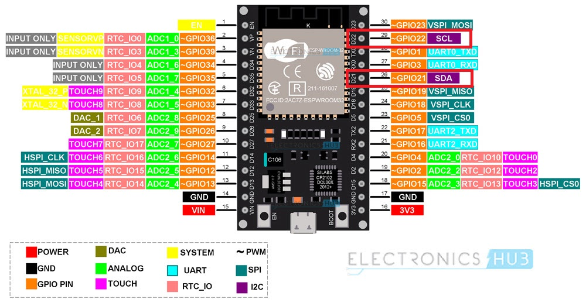

The hardware package is assembled on a no-solder breadboard. The wiring diagram below shows how everything is connected together.

## Components

The two main components are the **u-blox NEO-M8** GNSS module and the **MPU6050** accelerometer + gyroscope module.

### GNSS module

The GNSS module can be subsituted for pretty much any other available module, that communicates over **Serial**. The firmware is expecting valid NMEA messages on the Serial line with the following settings:

- **9600** baud
- **8** data bits
- no parity bits
- **1** stop bit

The module is communicating with the microcontroller using pins **16** and **17** (Rx & Tx respectively) according to the pinout schema in the image below.

### MPU6050

When it comes to the MPU6050, it communicated a little differently than the GNSS module. This module utilizes the [I2C bus](https://en.wikipedia.org/wiki/I%C2%B2C). In the image bellow is the modules pin schema. Besides VCC and GND, we need to connect it to the microcontroller with the Serial Clock and Data (**SCL** and **SDA**).

The ESP32 pinout below shows which pins to connect the module to (just follow the pin labels, i.e. SDA to SDA and SCL to SCL).

### LEDs

Besides the two mentioned modules, the solution is equipped with a button and a handful LEDs. See the table below for their purpose as well as their respective GPIO pins.

|  LED  | GPIO | Description                                                                                                                             |
|:-----:|:----:|-----------------------------------------------------------------------------------------------------------------------------------------|
| Blue  | 5    | Indicates the state of the WiFi hotspot, i.e. LED is ON when the hotspot is enabled                                                     |
| Green | 4    | Positional fix (>= 4 satellites means a locked fix and the LED lights up)                                                               |
| Red   | 18   | MQTT message publication (it blinks once for every published message), tells the overall status of MQTT alongside the publish frequency |

### Miscellaneous

Lastly, a button connected to GPIO pin **15** is used for runtime controls of the WiFi hotspot.

