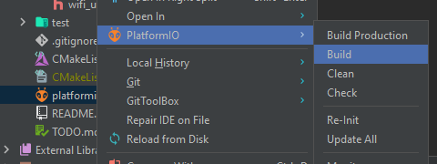

There are really two options when it comes to flashing the microcontroller firmware:

1. Head to [releases](https://github.com/Pzdrs/BP-firmware/releases) in the GitHub repository, download the binary and flash it
2. Clone the repository, set-up the environment and use PlatformIO to build the binaries and flash them that way

This page covers both these options.

## Cloning the repository

```bash
git clone https://github.com/Pzdrs/BP-firmware.git
cd BP-firmware
```

Using your favorite IDE, install the PlatformIO extension and open the project. In the Project view, right click the `platformio.ini` file and select "Build". This will compile the firmware and create a binary file in the `.pio/build/nodemcu-32s` directory.



Next, we need to flash the binary to the microcontroller using esptool. You can follow the instructions in the next section to do this.

## Downloading the binary directly

After every major change to the firmware the binary is compiled and released on GitHub. All releases can be found at [https://github.com/Pzdrs/BP-firmware/releases](https://github.com/Pzdrs/BP-firmware/releases).

We are going to download the binary itself and then use [**esptool**](https://github.com/espressif/esptool) to flash it.

So first off, download the binary file from the latest release. For example, to download the binary from the v1.0.0 release, run the following command:

```bash
wget https://github.com/Pzdrs/BP-firmware/releases/download/v1.0.0/firmware.bin
```

Next, we need to flash the binary to the microcontroller. We can use esptool's `write_flash` command to do this. The command is as follows:

```bash
python esptool.py -p (PORT) --chip esp32 write_flash firmware.bin
```

!!! warning "Common flashing issue"

    For some reason, the ESP32 sometimes refuses to flash because of the incorrect boot mode (in particular, the message "Wrong boot mode detected (0x13)! The chip needs to be in download mode."). This can usually be resolved by just running the command again or by manually putting the ESP32 into download mode.

    Press and hold the BOOT button on the ESP32, then press and release the EN button. After that, release the BOOT button. The ESP32 should now be in download mode and ready to be flashed.