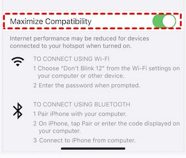

If you don't find the answer to your question here, feel free to raise an issue on our [GitHub repository](https://github.com/Pzdrs/BP-firmware/issues). Please provide as much information as possible, including the Serial logs from the device.

## Data source literally does nothing after powering it on

This sometimes happens and I have no idea why. The only solution I have found is to power cycle the device - either replug the usb cable or simply press the *EN* button on the ESP. If that doesn't work, try re-flashing the firmware.

## My WiFi network is not showing up in the list of available networks

If you're trying to connect to a mobile hotspot, make sure that the hotspot is turned on and that the device is in range. 

The ESP32 supports 2.4GHz networks only, so make sure that your network is broadcasting on the correct frequency. On iOS, you can check this by going to `Settings > Personal Hotspot` and make sure that `Maximize Compatibility` is turned on as seen in the picture below.

On Android, you can check this by going to `Settings > Network & Internet > Wi-Fi > Your Network > Details`.

If you're still having trouble, power cycling the device should resolve the issue.

## Nothing is happening, the device just sits there

The GNSS module, if left unpowered for a long time (~**12.5** minutes), can take a while to get a fix. It also is very particular about the antenna placement. Here are some tips to get a fix faster:

- Make sure the antenna is placed outside, with a clear view of the sky
- After acquiring a fix, the device needs to send the data to the server, make sure the device is connected to WiFi
- If the device is still not sending data, try power cycling it

There are multiple indication diodes that can tell you what the device is doing. For more information, check the [LED Indicators](../construction/index.md#leds) section.
