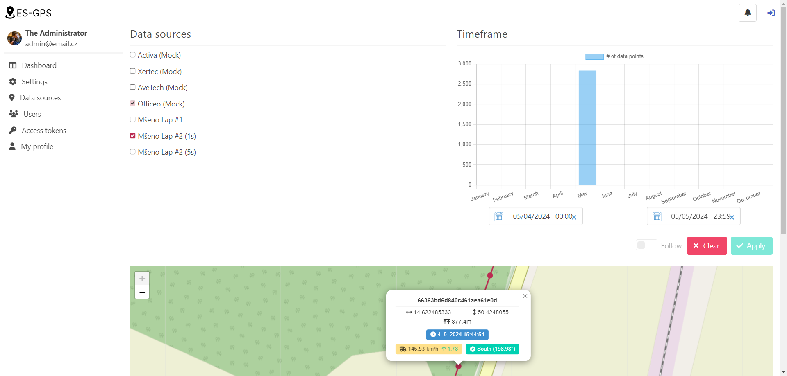

#

  

 Introducing our cutting-edge position tracking solution! With a powerful web application dashboard and hardware GPS data source, you can effortlessly keep tabs on your assets, vehicles, or loved ones. Our solution provides real-time location updates, allowing you to monitor and manage everything from a single platform. Stay in control and make informed decisions with our reliable and user-friendly system. Experience the convenience and peace of mind that comes with our position tracking solution.

  

