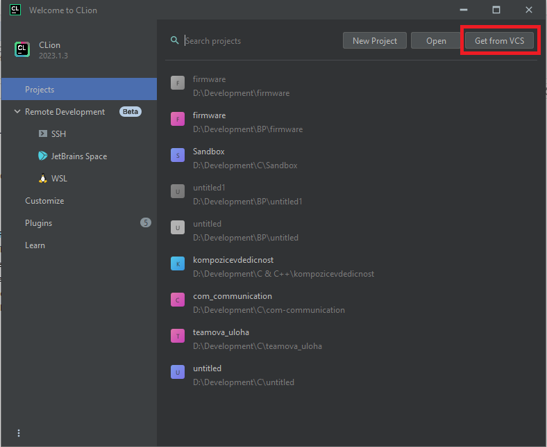
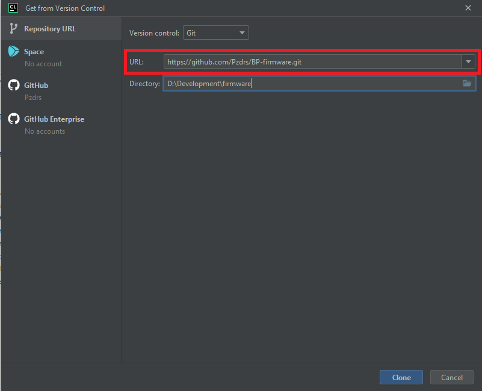
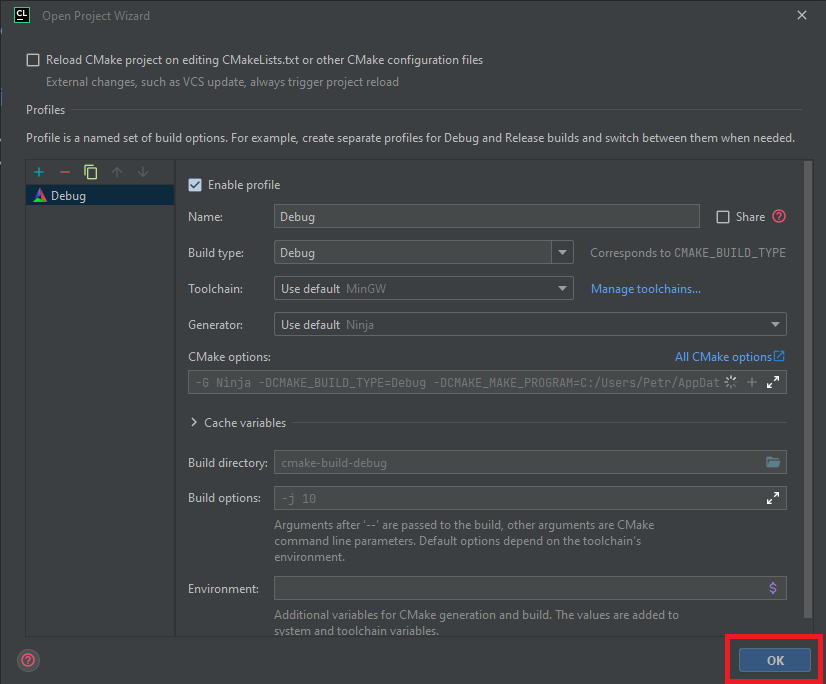

## Development Overview

Depending on which part of the project you want to contribute to, you will need to set up a different environments. The following sections will guide you through setting up the development environment for each part of the project.

The project is split into two main parts - the firmware and the web interface, each one with its own repository.

### Firmware

The firmware is a C++ application that runs on the ESP32 microcontroller. The firmware is responsible for collecting data from the sensors and sending it to the backend. The firmware is built using PlatformIO, so you will need to have it installed on your machine.

The simplest way to get started is with CLion. Click on `Get from VCS` and paste the [link](https://github.com/Pzdrs/BP-firmware.git) to the repository. CLion will automatically create a CMake project for you.





### Dashboard

The dashboard consists of the backend and the frontend. Both codebases share the same repository, so regardless of which part you want to contribute to, you will need to clone the repository:

```bash
git clone https://github.com/Pzdrs/BP-app.git
```

Any contributions should be made to the `develop` branch. The `main` merging process is done by the maintainers.

#### Backend

The backend is a Spring Boot application that uses Gradle as a build and dependency management tool. To run the backend, you will need to have Java 21 installed on your machine.

To run the backend, navigate to the `backend` directory and run the following command:

```bash
./gradlew bootRun
```

If you take a look in `main/resources/application.yaml`, you will see some environment variables are needed for the application to start. You can either set them in your environment or create a `.env` file in the `backend` directory.

#### Frontend

The frontend of the application is taken care of by VueJS 3. To run the frontend, you will need to have NodeJS installed on your machine.

To run the frontend, navigate to the `frontend` directory and run the following command:

```bash
npm install
```

After all the dependencies are installed, you can run the frontend with:

```bash
npm run dev
```
